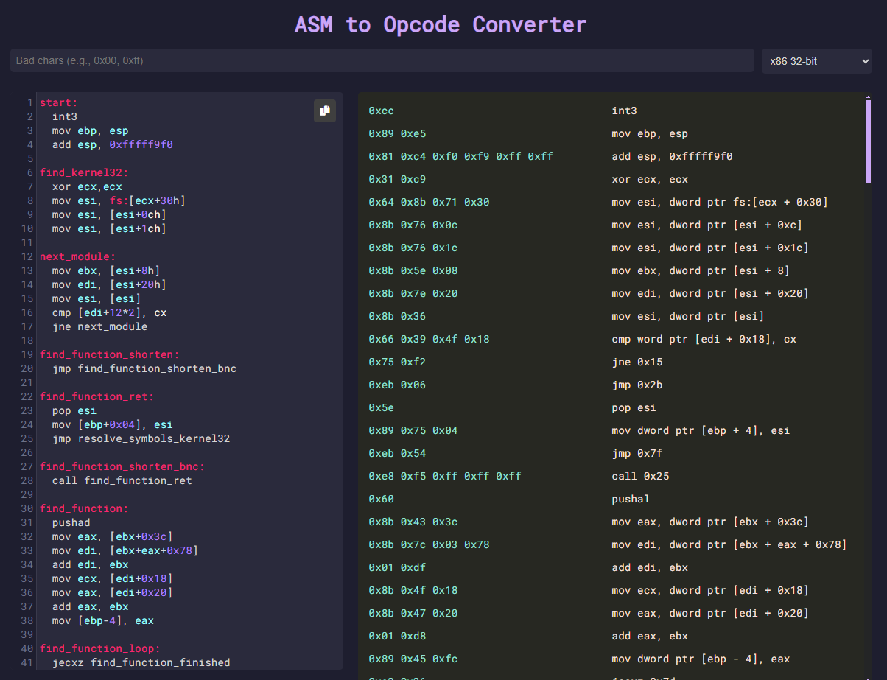

# asm-opcode-converter

This website converts assembly code to opcodes and correlates these opcodes to the relevant assembly code. 

## Features
- Supports syntax highlighting in input
- Highlights the badchars and the relevant assembly code
- Shows the number of occurrences of badchars
- Dynamically updates the opcodes and badchar matches based on input
- Supports edit and copy/paste of asm directly in the input panel

## Website

---
